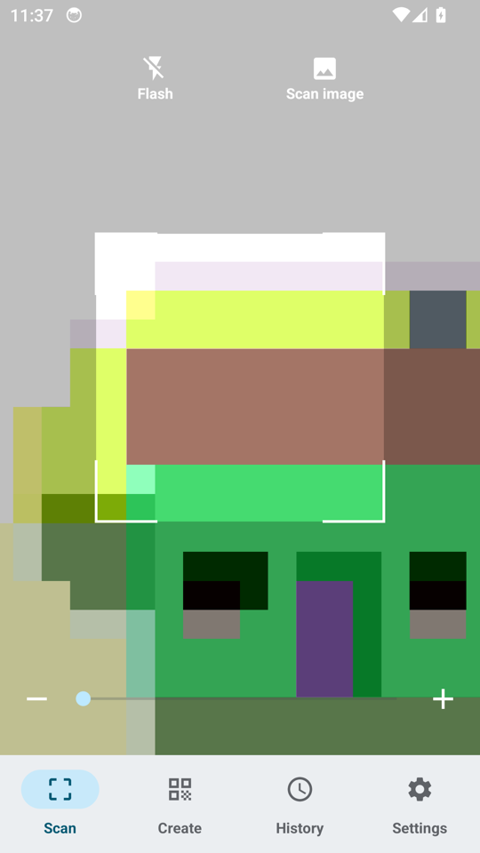
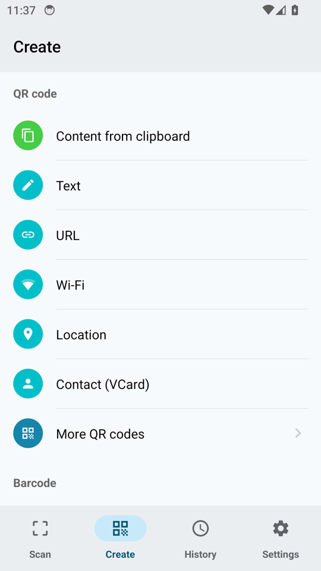
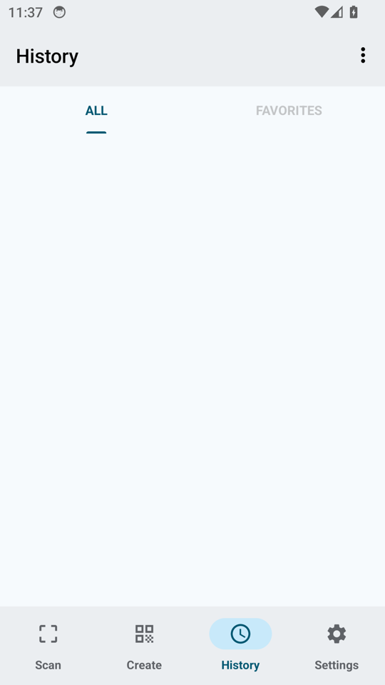
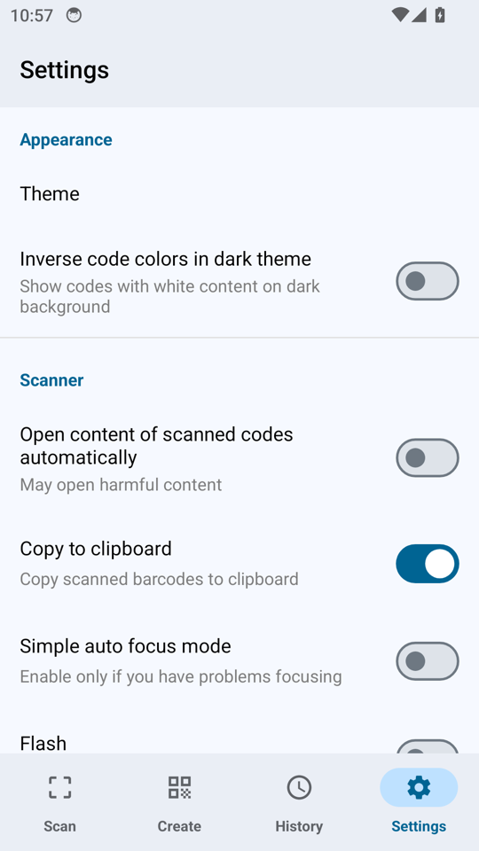
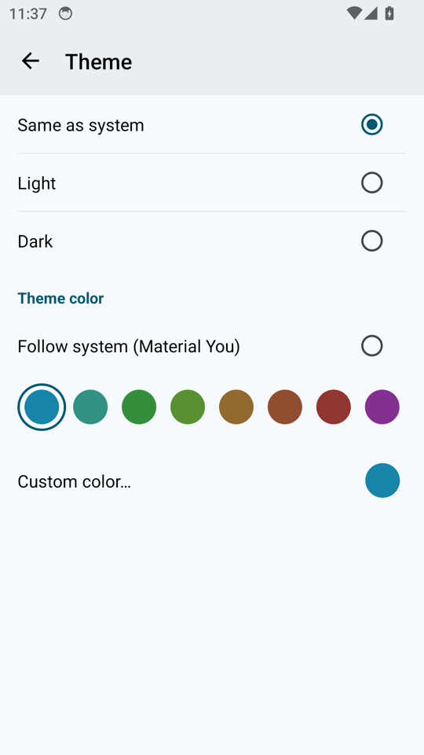
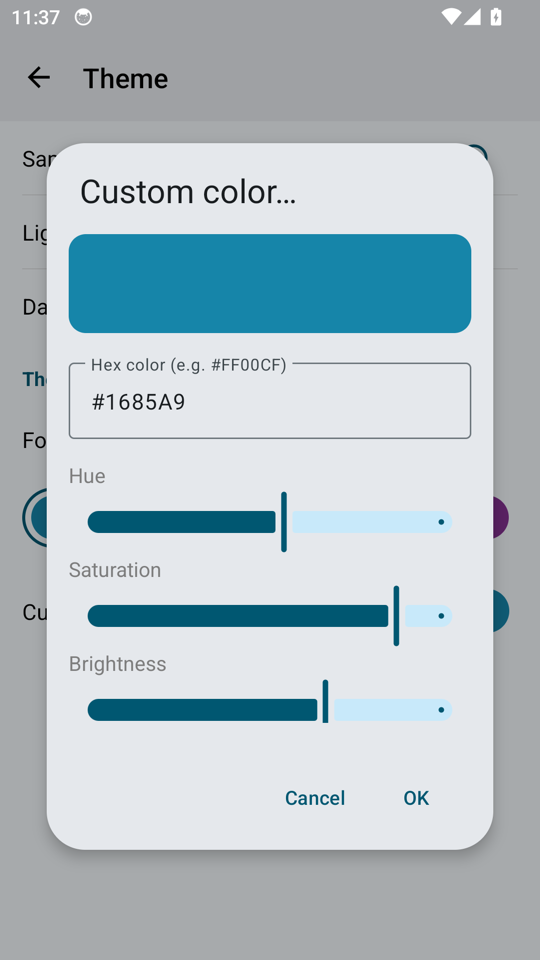

# QR & Barcode Scanner（个人修改版）

[English](https://github.com/sparky0915/QrAndBarcodeScanner/blob/master/README.md)

无广告的 Android 二维码 / 条码扫描器 —— 个人修改版，主要改动是 Material 3 / Material You 主题化。

[](http://unlicense.org/)
[](https://github.com/sparky0915/QrAndBarcodeScanner/releases/latest)

> **这是个人修改版（fork）**，fork 自 [wewewe718/QrAndBarcodeScanner][upstream]，
> 基于 **Unlicense（公有领域）** 代码修改。完整改动与构建踩坑记录见
> [BUILD-NOTES.md](BUILD-NOTES.md)。**上游原版**请前往 [原仓库][upstream] ——
> 本仓库的构建仅供个人使用。

## 相对上游的改动

**Material 3 / Material You 主题化**
- 跟随系统动态取色（Android 12+ 的 Monet）
- 8 套预设色板：蓝 / 青 / 绿 / 黄绿 / 琥珀 / 橙 / 红 / 粉
- 自定义取色：HSV 三滑块 + Hex 色值输入框，双向联动
- 按种子色生成整套 M3 色阶（含 surface 系列），标题栏 / 状态栏 / 底部导航 / 内容
  同色系自然分层

**HyperOS / MIUI 适配**
- 修复底部导航栏与内容之间的"分层"色块（导航栏透明 + 关闭对比度强制）
- 扫描页保持**沉浸式状态栏**，相机预览铺到状态栏下

**缺陷修复**
- 修复 targetSdk 30+ 下无法唤起第三方浏览器（补 `<queries>`，去掉 `resolveActivity` 硬门槛）
- 修复长按图标的快捷方式指向旧包名
- 移除上游作者的 Sentry 上报：本构建**不向任何第三方发送数据**

**工程升级**：Gradle 8.2 / AGP 8.2.2 / compileSdk 34 / JDK 17
（Kotlin 锁定 1.7.22，原因见 BUILD-NOTES）

## 截图

     

> 扫描页的相机画面是 Android 模拟器的合成测试场景（截图取自模拟器）。

## 下载

见本仓库 **[Releases](../../releases)**。

- Android 7.0+（minSdk 21）
- 包名 `com.lawrencej.barcodescanner` —— 与上游原版包名不同，**可以共存**

## 构建

```bash
export JAVA_HOME=/path/to/jdk17
export ANDROID_HOME=/path/to/android-sdk

./gradlew assembleDebug      # 调试包
./gradlew assembleRelease    # 正式包（需自行配置签名，见 BUILD-NOTES.md）
```

> ⚠️ Kotlin 必须保持 **1.7.22**：`kotlin-android-extensions` 在 Kotlin 1.8.0 起是硬错误，
> 而本项目 57 个文件还在用 `kotlinx.android.synthetic`。详见 [BUILD-NOTES.md](BUILD-NOTES.md)。

## 支持的条码格式

| 读取 | 生成 |
|---|---|
| [AZTEC][aztec] | [AZTEC][aztec] |
| [CODABAR][codabar] | [CODABAR][codabar] |
| [CODE-39][code_39] | [CODE-39][code_39] |
| [CODE-93][code_93] | [CODE-93][code_93] |
| [CODE-128][code_128] | [CODE-128][code_128] |
| [DATA MATRIX][data_matrix] | [DATA MATRIX][data_matrix] |
| [EAN-8][ean_8] | [EAN-8][ean_8] |
| [EAN-13][ean_13] | [EAN-13][ean_13] |
| [ITF][itf] | [ITF][itf] |
| [PDF417][pdf417] | [PDF417][pdf417] |
| [QR CODE][qr_code] | [QR CODE][qr_code] |
| [RSS 14][rss] | |
| [RSS EXPANDED][rss] | |
| [UPC-A][upc_a] | [UPC-A][upc_a] |
| [UPC-E][upc_e] | [UPC-E][upc_e] |
| [UPC-EAN EXTENSION][upc_ean] | |

## 许可与致谢

- 基于 [wewewe718/QrAndBarcodeScanner][upstream]，**Unlicense（公有领域）**：可自由复制、修改、
  发布、分发，商用或非商用皆可（详见 [LICENSE](LICENSE)）
- 扫码能力来自 [ZXing][zxing]
- 上游原版的翻译协作见 [Transifex][transifex]（本 fork 未参与）

[upstream]: https://github.com/wewewe718/QrAndBarcodeScanner
[zxing]: https://github.com/zxing/zxing
[transifex]: https://www.transifex.com/a-302/qr-barcode-scanner/
[aztec]: https://en.wikipedia.org/wiki/Aztec_Code
[codabar]: https://en.wikipedia.org/wiki/Codabar
[code_39]: https://en.wikipedia.org/wiki/Code_39
[code_93]: https://en.wikipedia.org/wiki/Code_93
[code_128]: https://en.wikipedia.org/wiki/Code_128
[data_matrix]: https://en.wikipedia.org/wiki/Data_Matrix
[ean_8]: https://en.wikipedia.org/wiki/EAN-8
[ean_13]: https://en.wikipedia.org/wiki/International_Article_Number
[itf]: https://en.wikipedia.org/wiki/Interleaved_2_of_5
[pdf417]: https://en.wikipedia.org/wiki/PDF417
[qr_code]: https://en.wikipedia.org/wiki/QR_code
[rss]: https://en.wikipedia.org/wiki/GS1_DataBar
[upc_a]: https://en.wikipedia.org/wiki/Universal_Product_Code
[upc_e]: https://en.wikipedia.org/wiki/Universal_Product_Code#UPC-E
[upc_ean]: https://en.wikipedia.org/wiki/Universal_Product_Code#EAN-13
